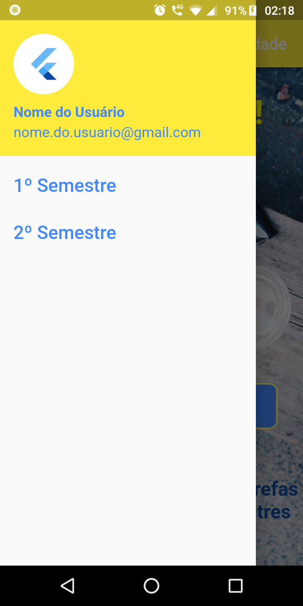
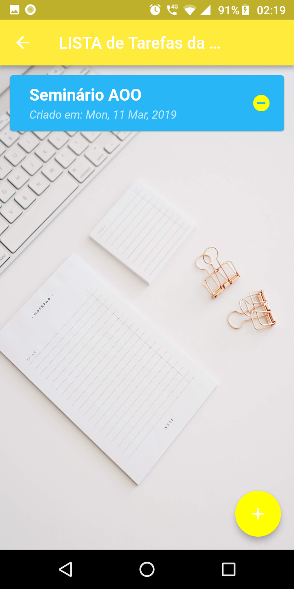
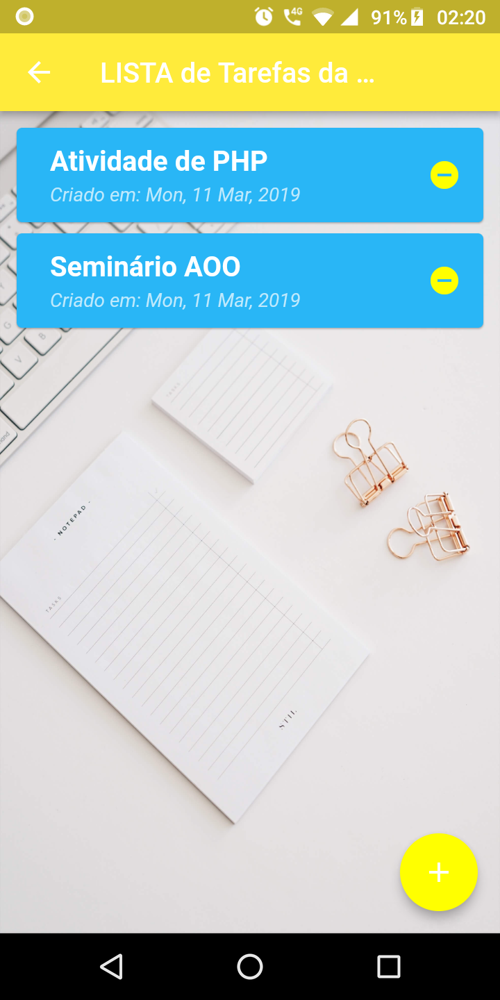
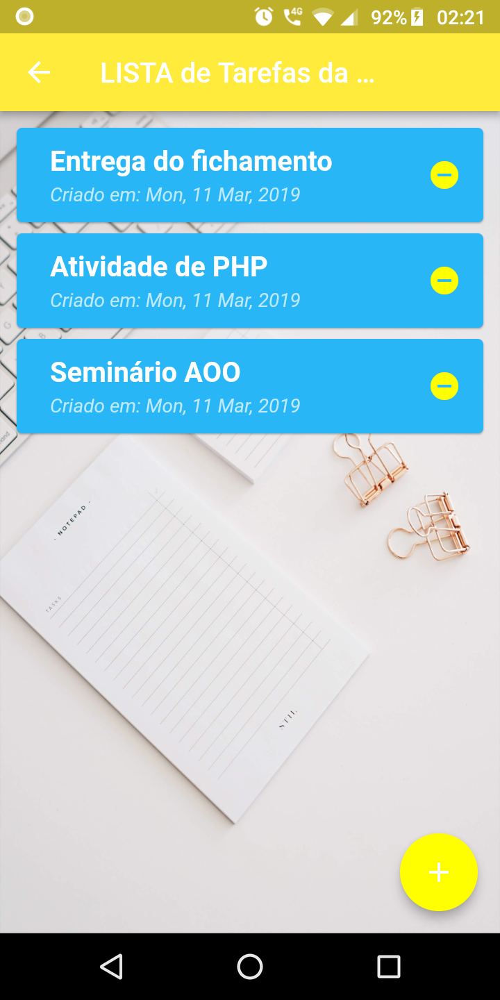

# college_events_and_tasks
Esse app tem o objetivo de auxialar na organização dos eventos e tarefas relacionados ao 1º e 2º semestres da faculdade.

WARNING: O app se encontra em processo de desenvolvimento.

SCREENSHOTS:

    &nbsp;  &nbsp;
    &nbsp;    &nbsp; 
    &nbsp;  

TECNOLOGIAS UTILIZADAS NO DESENVOLVIMENTO: 
Flutter Framework (https://flutter.dev/)

FEATURES:

Concluído:
- Create, Delete e Update dos Eventos/Tarefas
- Implementação do banco de dados SQFlite (https://pub.dartlang.org/packages/sqflite)
- Implementação do UserAccountsDrawerHeader (https://docs.flutter.io/flutter/material/UserAccountsDrawerHeader-class.html)
- Separação entre página principal e secundária com navegação por NAME ROUTE (https://flutter.dev/docs/cookbook/navigation/named-routes)

Em Andamento:
- Autenticação com o google services
- Adição de calendário e relógio para a função lembrete
- Local authentication com sensor de impressão digital (https://pub.dartlang.org/packages/local_auth)

